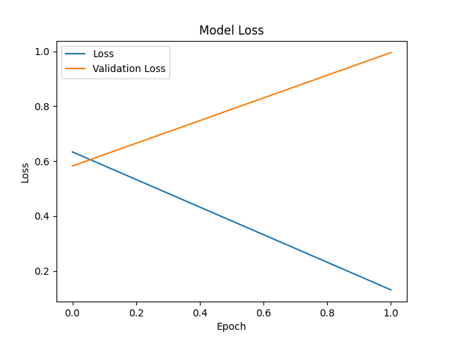
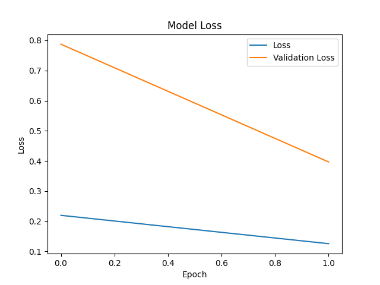

# Group 1  
## CS 5330 – Computer Vision  
### Assignment 9: Multi-Class Object Recognition and Optimization  

---

## Assignment 9-1: Multi-Class Object Recognition

### Dataset

- **Classes**: Remote Control, Keyboard  
- **Total Images**: 200 (100 per class)  
- **Image Size**: 640x640  
- **Collection Method**: Reused from Mini-Project 8  
- **Labeling Tool**: Annotated using LabelMe
- **Annotation Format**: JSON → CSV using `json_to_csv.py`

### Model

- **Model Used**: VGG16-based R-CNN (from `rcnn_basic.py`)  
- **Modified Code File**: `rcnn-multi.py`  
- **Frameworks**: Keras, TensorFlow  
- **Training Parameters**:  
  - Batch Size: 16  
  - Epochs: 10  
  - Optimizer: Adam  
  - Loss Function: Binary Crossentropy  
  - Validation Split: 5%  

### Results

- Model successfully detects both classes from test images  
- Output bounding boxes for keyboard and remote control are accurate

---

## Assignment 9-2: Performance Enhancement & Webcam Integration

### Webcam Integration

- **Application File**: `WebCamSave-rcnn.py`  
- **Test Input**: Live webcam detecting Remote Control and Keyboard  
- **Initial Model**: VGG16-based R-CNN  
- **Enhanced Model**: MobileNet-based R-CNN (`rcnn_light.py`)  

### Optimized Parameters

--------------------------------------------------------------------------------
| Parameter                     | Original Value     | Optimized Value         |
|------------------------------|--------------------|--------------------------|
| Region Proposals             | 2000               | 300                      |
| IoU Positive Threshold       | 0.7                | 0.6                      |
| IoU Negative Threshold       | 0.3                | 0.2                      |
| Epochs (Feature Extractor)   | 1                  | 5                        |
| Epochs (Classifier Head)     | 2                  | 5                        |
| Batch Size                   | 16                 | 32                       |
| Loss Function                | hinge              | categorical_crossentropy |
| Classifier Activation        | None               | softmax                  |
--------------------------------------------------------------------------------

### Results

- MobileNet significantly improved FPS with minor accuracy tradeoff  
- Acceptable for real-time use with webcam  
- Visual detection remains reliable for both object classes  

### Dataset Download
https://drive.google.com/drive/folders/14ONuVtsoLCdnzZu-nJijrmH1qn80-VB-?usp=drive_link